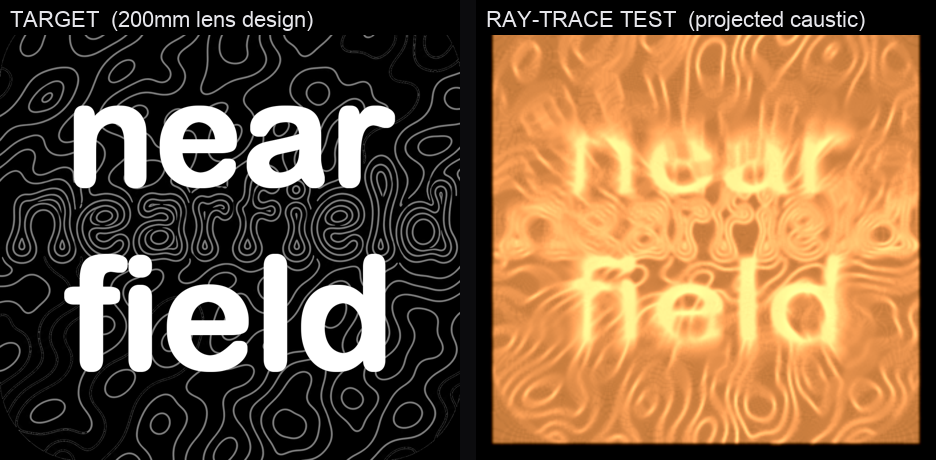

# Nearfield caustic lens

A 3D-printable **clear lens** whose one shaped surface refracts collimated light
into the Nearfield mark — a glowing **"near / field"** wordmark inside the
topographic interference field — projected onto a wall a short distance away
(a "magic window" / goal-based caustic).



## Method

Matt Ferraro's [caustics engineering](https://mattferraro.dev/posts/caustics-engineering),
which builds on Yue et al., *"Poisson-Based Continuous Surface Generation for
Goal-Based Caustics."* A flat-bottomed clear slab gets a subtly shaped top; the
shape is solved so that uniform incoming light is redistributed into the target
image on a screen at distance `d`.

Pipeline (`caustic_lens.py`):
1. **target** – image → grayscale, epsilon floor, normalize to mean 1 (light = area).
2. **transport** – linearized Monge–Ampère / optimal transport by Poisson relaxation
   (Neumann BC via DCT): find a potential Φ so the map `X → X + ∇Φ` sends uniform
   light to the target.
3. **heights** – thin-prism relation `h = -Φ / (d·(n-1))` (a downward ray on a
   surface rising in +x bends toward the −∇h normal → deflects −x).
4. **mesh** – shaped top + flat bottom + walls → watertight solid → STL.
5. **ray-trace test** – *independent* check: shoot parallel rays, do full two-surface
   vector Snell refraction, propagate to the screen, histogram the landings → the
   caustic the lens actually makes. (Validated on a disk target = crisp disk.)

## Regenerate

```bash
pip install numpy scipy pillow trimesh
ICON=../../NearfieldEnsemble/Assets.xcassets/AppIcon.appiconset/AppIcon1024.png

# combined target: fine topo field + dominant 2-line wordmark
python make_target.py --icon "$ICON" --out target_combo.png --topo-weight 0.5 --word-scale 0.72

# 200 mm lens, fine relief, high-quality ray-trace test
python caustic_lens.py --image target_combo.png -N 512 --L 200 --d 440 \
    --blur 0.6 --floor 0.04 --iters 110 --rays 1700 --res 480 --out out_200
```

Outputs `out_200/nearfield_caustic_lens.stl` + `target.png` + `caustic_sim.png`.

## The deliverable — `out_200/nearfield_caustic_lens.stl`

- **200 × 200 mm** footprint, **7.87 mm** thick (3 mm base + 4.87 mm relief)
- **~0.19 L** clear resin, watertight, ~1.05 M faces (~52 MB)
- Designed for **n ≈ 1.51 clear resin**, **throw ≈ 440 mm**, collimated light

## What resolves, and what doesn't

Caustics only concentrate light into **bold, large features** — they cannot make
sharp thin/dark detail. Findings from the ray-trace tests:

- **Thin topo lines / one-line "nearfield"** → dissolve into streaks. Illegible.
- **Finer relief** (bigger / higher-res / well-polished lens) → recovers the topo
  contour lines dramatically (see `RESULT_size-comparison.png`). Uniform scaling
  *alone* (lens + throw together) is scale-invariant — no sharpness gain.
- **Bold 2-line "near / field"** → legible; tall letters give the caustic enough
  to resolve. The shipped target combines this with the fine topo.

## Printing

- **Clear SLA/resin only** — FDM is too cloudy.
- 200 mm fits a **Formlabs Form 3L** (335 × 200) in one piece; it exceeds most
  hobby MSLA beds → use a print bureau, or cast clear epoxy from a printed mold.
- **Polishing is the make-or-break step**: sand progressively fine and clear-coat
  the shaped surface to optical smoothness. Roughness scatters the caustic away.
- **Use:** shaped side toward a collimated/point light (sun ideal), flat side
  toward a wall **~44 cm** away.
- The 52 MB / 1 M-face mesh can be decimated ~4× with no visible loss if a slicer
  chokes; a longer throw makes the relief shallower (easier to polish).
