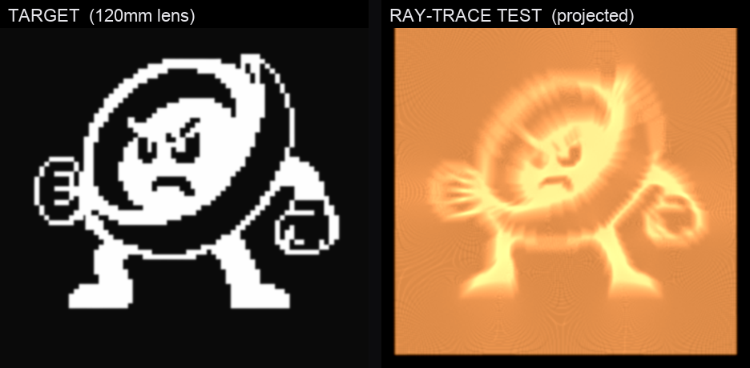

# Nearfield caustic lens

A 3D-printable **clear lens** whose one shaped surface refracts collimated light
into the Nearfield mark — a glowing **"near / field"** wordmark inside the
topographic interference field — projected onto a wall a short distance away
(a "magic window" / goal-based caustic).


## Method

Matt Ferraro's [caustics engineering](https://mattferraro.dev/posts/caustics-engineering),
which builds on Yue et al., *"Poisson-Based Continuous Surface Generation for
Goal-Based Caustics."* A flat-bottomed clear slab gets a subtly shaped top; the
shape is solved so that uniform incoming light is redistributed into the target
image on a screen at distance `d`.

Pipeline (`caustic_lens.py`):
1. **target** – image → grayscale, epsilon floor, normalize to mean 1 (light = area).
2. **transport** – linearized Monge–Ampère / optimal transport by Poisson relaxation
   (Neumann BC via DCT): find a potential Φ so the map `X → X + ∇Φ` sends uniform
   light to the target.
3. **heights** – thin-prism relation `h = +Φ / (d·(n-1))`. A slab that is thicker
   toward +x is a prism with its base at +x, and a prism deviates light toward its
   base, so `landing = X + d(n-1)∇h`.
4. **mesh** – shaped top + flat bottom + walls → watertight solid → STL.
5. **ray-trace test** – *independent* check: shoot parallel rays, do full two-surface
   vector Snell refraction, propagate to the screen, histogram the landings → the
   caustic the lens actually makes. (Validated on a disk target = crisp disk.)

## Regenerate

```bash
pip install numpy scipy pillow trimesh
ICON=../../NearfieldEnsemble/Assets.xcassets/AppIcon.appiconset/AppIcon1024.png

# combined target: fine topo field + dominant 2-line wordmark
python make_target.py --icon "$ICON" --out target_combo.png --topo-weight 0.5 --word-scale 0.72

# 200 mm lens, fine relief, high-quality ray-trace test
python caustic_lens.py --image target_combo.png -N 512 --L 200 --d 440 \
    --blur 0.6 --floor 0.04 --iters 110 --rays 1700 --res 480 --out out_200
```

Outputs `out_200/nearfield_caustic_lens.stl` + `target.png` + `caustic_sim.png`.

## The deliverable

Two print-ready sizes (same target, `n ≈ 1.51` clear resin, collimated light):

- **`out_200/nearfield_caustic_lens.stl`** — 200 × 200 mm, 7.87 mm thick, throw ≈ 440 mm,
  ~0.19 L resin, ~1.05 M faces (~52 MB). Fits a Formlabs Form 3L.
- **`out_120/nearfield_caustic_lens.stl`** — 120 × 120 mm, 5.92 mm thick, throw ≈ 264 mm,
  ~0.06 L resin. **Fits an Elegoo Saturn 8K (219 × 123)** and most desktop MSLA; shallower
  2.9 mm relief (easier to polish). The ideal caustic is scale-invariant, so it reads the same.

Both print **flat** — the shaped top is the optical surface, so no supports or angled layer
lines on it — then sand progressively fine + clear-coat to polish. Regenerate a size with
`caustic_lens.py --L <mm> --d <~2.2*L>`.

## What resolves, and what doesn't

Caustics only concentrate light into **bold, large features** — they cannot make
sharp thin/dark detail. Findings from the ray-trace tests:

- **Thin topo lines / one-line "nearfield"** → dissolve into streaks. Illegible.
- **Finer relief** (bigger / higher-res / well-polished lens) → recovers the topo
  contour lines dramatically (see `RESULT_size-comparison.png`). Uniform scaling
  *alone* (lens + throw together) is scale-invariant — no sharpness gain.
- **Bold 2-line "near / field"** → legible; tall letters give the caustic enough
  to resolve. The shipped target combines this with the fine topo.

## Printing

- **Clear SLA/resin only** — FDM is too cloudy.
- 200 mm fits a **Formlabs Form 3L** (335 × 200) in one piece; it exceeds most
  hobby MSLA beds → use a print bureau, or cast clear epoxy from a printed mold.
- **Polishing is the make-or-break step**: sand progressively fine and clear-coat
  the shaped surface to optical smoothness. Roughness scatters the caustic away.
- **Use:** shaped side toward a collimated/point light (sun ideal), flat side
  toward a wall **~44 cm** away.
- The 52 MB / 1 M-face mesh can be decimated ~4× with no visible loss if a slicer
  chokes; a longer throw makes the relief shallower (easier to polish).

## Zeroman lens — `out_zeroman/zeroman_caustic_lens.stl`



A second lens using the 8-bit Zeroman character. It's a much better caustic subject
than the topo lines: one bold, solid, high-contrast silhouette (~20% ink) is exactly
what a caustic can concentrate light into.

- **120 × 120 mm**, ~6.2 mm thick (3 mm base + **3.15 mm relief**), throw ≈ 264 mm,
  clear resin `n ≈ 1.51`. Fits an Elegoo Saturn 8K.
- The source art is RGBA with a **transparent** background, so it must be composited
  onto white first (`target_zeroman_src.png`). Feeding the raw PNG to `convert("L")`
  reads the transparency as ink (86% "dark") and the target comes out wrong.

```bash
python caustic_lens.py --image target_zeroman_src.png --invert --blur 1.2 \
    -N 512 --iters 110 --floor 0.04 --L 120 --d 264 --rays 1700 --res 480 --out out_zeroman
```

**Don't over-iterate.** Transport iterations past ~150 over-concentrate light into thin
caustic filaments (ray folding): at 260 iterations the figure dissolves into a spray of
bright threads *and* the relief balloons to 7.5 mm. Low iteration counts win — they also
keep the relief shallow, which is what makes it polishable. See `RESULT_zeroman_options.png`.

### Ordering it printed + polished

Send it out in **Accura ClearVue** (SLA, ~92% light transmission — it's made for lenses)
with a **clear-coat** finish, e.g. Xometry's "SLA Quick Clear". Critical instruction for
the vendor: **clear-coat only, do not sand or flatten the contoured face** — that surface
*is* the lens, and abrading it destroys the relief. The flat back face may be polished
normally.


## Interactive simulator — `web/`

`web/index.html` is a WebGL simulator: the lens in 3D plus the caustic computed
**live on the GPU** — ~1,000,000 rays refracted through the real height field each
frame (`web/heightmap.png`, exported by `export_heightmap.py`, is the same surface
the STL is built from). Drag to orbit; tilt the light, change the throw distance, or
switch to a point source to watch the image defocus and smear.

```bash
cd web && python3 -m http.server 8870   # then open http://127.0.0.1:8870/
```

## A sign bug worth knowing about

An earlier version had **two errors that cancelled**: `heights_from_potential`
negated Φ, and `simulate()` used a flat exit normal of `-Z` (which silently negates
the transverse deflection). The rendered test images looked right, so the bug hid —
but the **exported surface was inverted**, and a real print would have projected the
negative (dark figure on a bright square).

The WebGL simulator, written independently with textbook Snell conventions, exposed
it: it rendered the inverse. Both are fixed, and the offline tracer and the GPU
simulator now agree. If you ever change the refraction code, **re-run the disk demo**
— `--demo disk` must produce a bright disk, not a bright ring with a dark centre:

```bash
python caustic_lens.py --demo disk -N 192 --iters 40 --out out_disk
```
